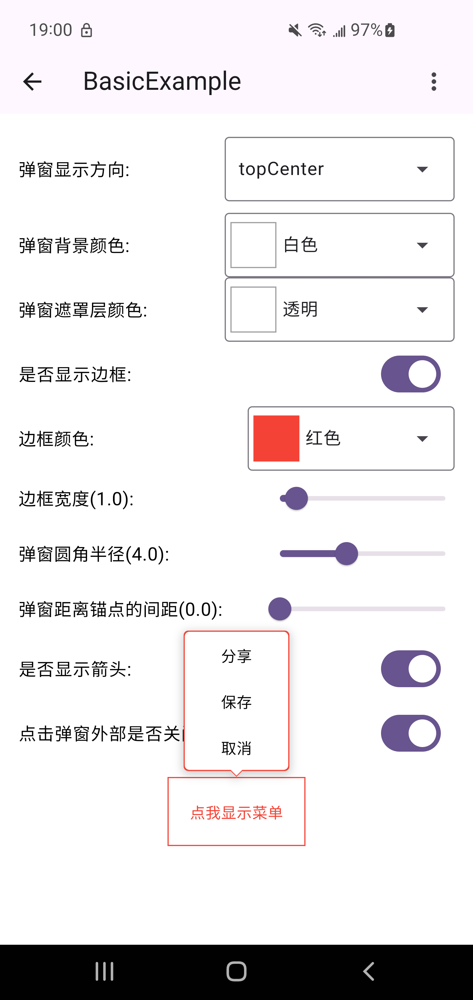
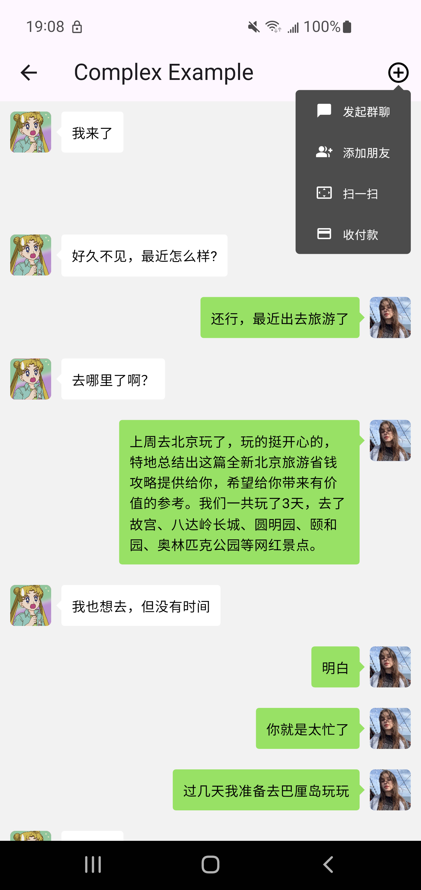
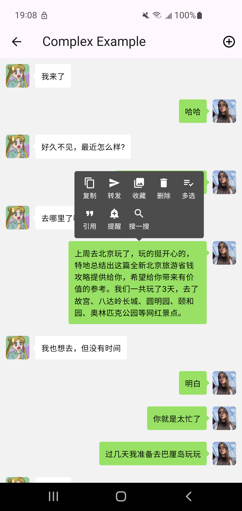

# Bubble Popup Window

Flutter气泡弹窗库，提供带箭头指示器的浮动弹窗组件。

## 截图

<div style="display: flex;">
  
  
   
</div>

## 功能特性

- 🎯 **12种定位选项**：支持上下左右各个方向及对齐方式的弹窗定位
- 🔄 **智能位置调整**：自动检测边界并调整弹窗位置确保完全可见
- 🎨 **高度可定制**：支持自定义间距、边距、箭头大小和颜色等样式
- 🎭 **交互控制**：支持点击外部关闭、遮罩层颜色设置等功能

## 安装

在pubspec.yaml文件中添加依赖：

```yaml
dependencies:
  bubble_popup_window: ^0.0.2
```

## 使用

```dart
import 'package:bubble_popup_window/bubble_popup_window.dart';

GlobalKey key = GlobalKey();

ElevatedButton(
  key: key,
  onPressed: () {
    _showToolTip(key.currentContext!);
  },
  child: const Text("Tooltip"),
)

void _showToolTip(BuildContext anchorContext) {
  BubblePopupWindow.show(
    //锚点上下文
    anchorContext: anchorContext,
    //弹窗布局，用户自定义
    child: const Text(
      '这是一个气泡弹窗',
      style: TextStyle(
        color: Colors.white,
        fontSize: 14,
        fontWeight: FontWeight.normal,
      ),
    ),
    //弹窗方向
    direction: BubbleDirection.bottomCenter,
    //弹窗颜色
    color: Colors.red,
    //弹窗圆角半径
    radius: BorderRadius.circular(8),
    //弹窗内边距
    padding: const EdgeInsets.all(16),
    //弹窗距离锚点间距
    gap: 4.0,
    //弹窗距离屏幕边缘最小间距
    miniEdgeMargin: const EdgeInsets.only(left: 10, right: 10),
    //遮罩层颜色
    maskColor: null,
    //点击弹窗外部时是否自动关闭弹窗
    dismissOnTouchOutside: true,
    //是否显示箭头
    showArrow: true,
    //箭头宽度
    arrowWidth: 12.0,
    //箭头高度
    arrowHeight: 6.0,
  );
}

```

## 参数说明

| 参数名                     | 类型                    | 默认值                            | 描述           |
|:------------------------|:----------------------|:-------------------------------|:-------------|
| `anchorContext`         | `BuildContext`        | 无                              | 锚点上下文        |
| `child`                 | `Widget`              | 无                              | 弹窗内容，用户自定义   |
| `direction`         | `BubbleDirection`     | `BubbleDirection.bottomCenter` | 弹窗方向         |
| `color`         | `Color`               | `Colors.white`                 | 弹窗颜色         |
| `radius`         | `BorderRadius`        | `BorderRadius.zero`            | 弹窗圆角半径        |
| `border`         | `BorderSide`          | `BorderSide.none`              | 弹窗边框         |
| `shadows`         | `List<BoxShadow>?`    | 无                              | 弹窗阴影         |
| `padding`         | `EdgeInsetsGeometry?` | 无                              | 弹窗内边距         |
| `gap`                   | `double`              | `0.0`                          | 弹窗距离锚点的间距    |
| `maskColor`             | `Color?`              | `null`                         | 遮罩层颜色        |
| `dismissOnTouchOutside` | `bool`                | `true`                         | 点击弹窗外部是否关闭弹窗 |
| `miniEdgeMargin`        | `EdgeInsets`          | `EdgeInsets.zero`              | 弹窗距离屏幕边缘最小间距 |
| `showArrow`             | `bool`                | `true`                         | 是否显示箭头       |
| `arrowWidth`            | `Double`              | `10.0`                         | 箭头宽度         |
| `arrowHeight`           | `Double`              | `5.0`                          | 箭头高度         |


## 弹窗方向选项

`BubbleDirection` 枚举提供了以下12种位置选项：

- **上方**: `topStart`, `topCenter`, `topEnd`
- **下方**: `bottomStart`, `bottomCenter`, `bottomEnd`
- **左侧**: `leftStart`, `leftCenter`, `leftEnd`
- **右侧**: `rightStart`, `rightCenter`, `rightEnd`
```dart
enum BubbleDirection {
  //弹窗在锚点上方，和锚点左边对齐
  topStart,
  //弹窗在锚点上方，和锚点居中对齐
  topCenter,
  //弹窗在锚点上方，和锚点右边对齐
  topEnd,

  //弹窗在锚点下方，和锚点左边对齐
  bottomStart,
  //弹窗在锚点下方，和锚点居中对齐
  bottomCenter,
  //弹窗在锚点下方，和锚点右边对齐
  bottomEnd,

  //弹窗在锚点左侧，和锚点顶部对齐
  leftStart,
  //弹窗在锚点左侧，和锚点居中对齐
  leftCenter,
  //弹窗在锚点左侧，和锚点底部对齐
  leftEnd,

  //弹窗在锚点右侧，和锚点顶部对齐
  rightStart,
  //弹窗在锚点右侧，和锚点居中对齐
  rightCenter,
  //弹窗在锚点右侧，和锚点底部对齐
  rightEnd;
}
```

## 许可证

[MIT License](https://github.com/kongpf8848/bubble_popup_window/blob/master/LICENSE)
